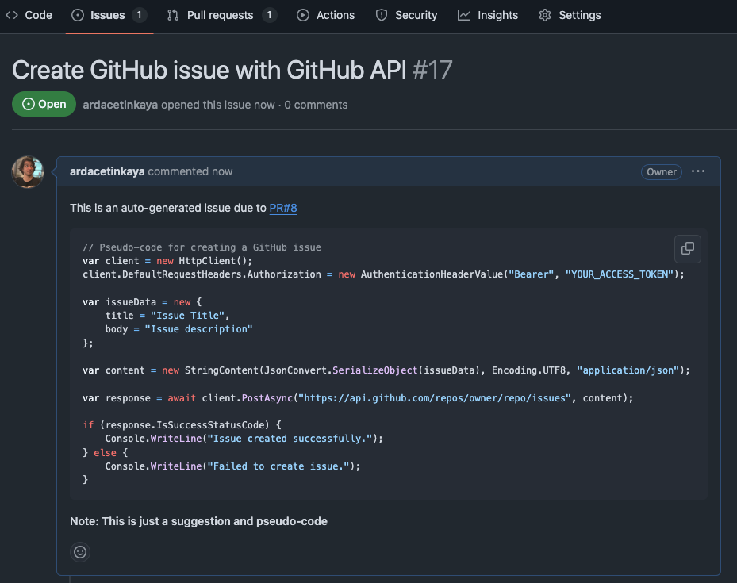

# Summarize Pull Request

A simple GitHub action that can create a brief information about commits in a pull request(PR). So, within brief, initial description of commit changes helps reviewing the PR.

And also if there are some TODOs comment in the code, an issue is generated automatically to follow-up the TODO and not missed. Within TODO issue, some brief code is also suggested so that for whom will take care of the issue will have some starting point.


| PR Description            |
| ------------------------- |
|   |

| Auto-generated issue for TODOs |
| ------------------------------ |
|      |


## How

With Microsoft.Extensions.AI, action provides access to use LLMs such as GPT-4o,Llama,Phi-3... to describe change sets. Within GitHub Models or Azure AI Model Catalog, models can be used with this action.

- Azure AI Model Catalog - https://ai.azure.com/explore/models
- GitHub Models - https://github.com/marketplace/models

Add the following GitHub action definition to your GitHub Action workflows
```yaml
name: Summarize PR

on:
  pull_request:
    branches: [ "main" ]
jobs:
  build:
    runs-on: ubuntu-latest
    steps:
    - uses: actions/checkout@v4
    - name: Summarize PR Action
      uses: ardacetinkaya/pull-request-action/@v1.0.0
      env:
        PAT: ${{ secrets.ACTION_TOKEN }}
        APIKey: ${{ secrets.AI_API_KEY }}
        ModelId: gpt-4o
        RepositoryName: ${{github.event.repository.name}}
        RepositoryAccount: ${{github.repository_owner}}
        CommitSHA: ${{ github.event.pull_request.head.sha }}
        PullRequestId: ${{github.event.number}}

```

### Requirements
1. Create an GitHub Access Token to be able to use GitHub Apis
   - Read and write to pull request is required
2. Create required access key for LLM models
3. Create secrets for the above access assets in the GitHub repo.


## Why

Mainly this is a kind of self-learning and proof-of-concept initiative to learn how LLMs can be used within .NET Platform.


## References

- Tutorial: Create a GitHub Action with .NET - https://learn.microsoft.com/en-us/dotnet/devops/create-dotnet-github-action
- Microsoft.Extensions.AI - https://devblogs.microsoft.com/dotnet/introducing-microsoft-extensions-ai-preview/

## Contributing

Contributions are more than welcome! Please submit a pull request or create an issue to discuss your ideas or feedbacks.

## License
This project is licensed under the MIT License.

